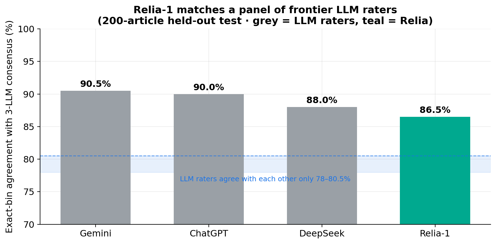
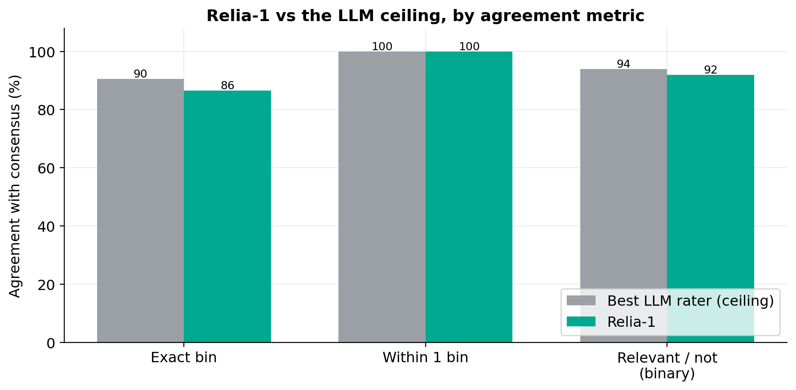
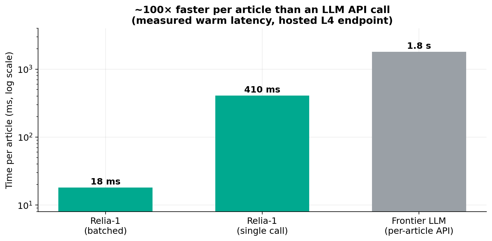
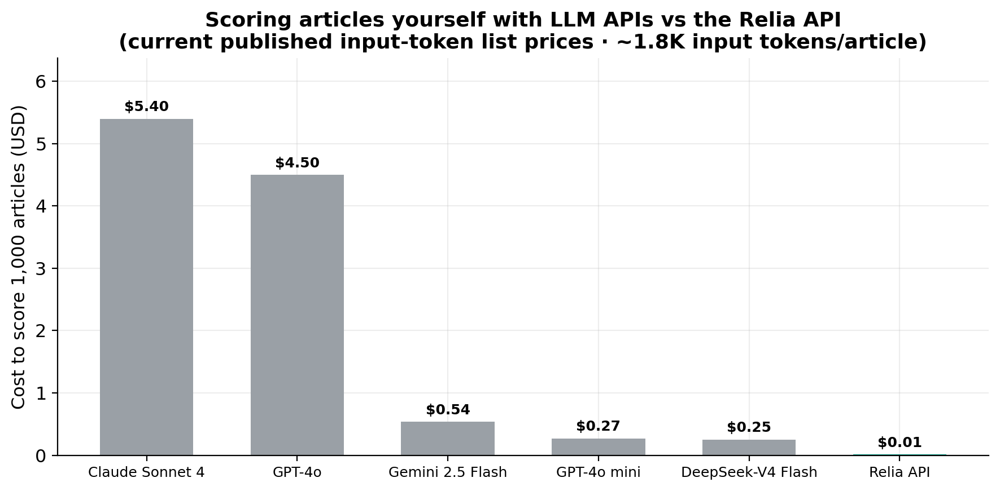

# Relia

**Financial relevance scoring — is this news article actually about this company?**

Relia is a hosted API. You send an entity (e.g. `NVDA`) and a batch of news articles and
get back a calibrated relevance score in `[0, 1]` for each one — telling apart an article
that *moves* the company from one that merely name-drops it. It reproduces the judgment of
a panel of frontier LLM raters, but runs as a tiny purpose-built model: **~100× faster**
and at a **fraction of the per-token cost**.

Current model: **`relia-1`** — a LoRA-adapted Qwen3-Embedding-0.6B bi-encoder with a
cumulative-link ordinal head.

---

## Why Relia

| | Relia-1 | Frontier LLM raters |
|---|---|---|
| **Accuracy** | 86.5% exact / **100% within-1-bin** agreement with a 3-LLM consensus | 88–90.5% (the ceiling) |
| **Speed** | **~18 ms/article** batched (measured) | ~1.8 s per article, per API call |
| **Cost** | **$1 / 1,000 requests** (first 2,000 free), no per-token metering | per-token billing, every call |
| **Dependencies** | one call to one model | an API round-trip (or three, for a consensus) |

The striking part: **Relia agrees with the LLM consensus (86.5%) more than the LLMs
agree with _each other_ (78–80.5%).** It sits inside the raters' own noise band.

<table>
  <tr>
    <td width="50%"></td>
    <td width="50%"></td>
  </tr>
  <tr>
    <td width="50%"></td>
    <td width="50%"></td>
  </tr>
</table>

> Charts are generated from aggregate metrics by
> [`validation/make_charts.py`](validation/make_charts.py). Full method and numbers in
> [`validation/README.md`](validation/README.md).

---

## What you get

For each article Relia returns:

- `score` — expected relevance in `[0, 1]`
- `level` — the argmax relevance bin (`0` irrelevant · `1` low · `2` medium · `3` high)
- `probs` — the full distribution over the four bins

## Example

**Request**

```bash
curl -X POST https://<your-deployment>/v1/score \
  -H "Content-Type: application/json" \
  -d '{
    "entity": "NVDA",
    "articles": [
      {"id": "a1", "title": "Nvidia unveils new Blackwell GPU for AI data centers",
       "body": "Nvidia announced its next-generation Blackwell architecture, boosting AI training performance ..."},
      {"id": "a2", "title": "Local bakery wins county pie contest",
       "body": "A small-town bakery took home first prize at the annual county fair ..."}
    ]
  }'
```

**Response**

```json
{
  "model": "relia-1",
  "entity": "NVDA",
  "scores": [
    {"id": "a1", "score": 0.875, "level": 3, "probs": [0.0, 0.0, 0.001, 0.999]},
    {"id": "a2", "score": 0.125, "level": 0, "probs": [1.0, 0.0, 0.0, 0.0]}
  ]
}
```

The Blackwell story lands in the top bin (`level 3`); the bakery story in the bottom
bin (`level 0`) — for the *same* entity, purely from the text.

You supply an **entity symbol**; Relia uses its own curated profile for that entity — you
never author or upload profiles. List supported entities with `GET /v1/entities`; an
uncovered symbol returns `404` (no silent fallback). See
[`docs/COVERAGE.md`](docs/COVERAGE.md).

Full API reference: [`docs/API.md`](docs/API.md).

---

## Pricing & rate limits

- **$1 per 1,000 requests** — 1 request = 1 entity + up to 100 articles.
- **First 2,000 requests free**, no time limit.
- **120 requests / minute** per API key.

[Get your API key](https://aletaindex-narrative.com). Full pricing and limits in
[`docs/PRICING.md`](docs/PRICING.md).

---

## About this repository

This repo is the **public interface for the Relia API** — the request/response schema,
API reference, coverage, benchmarks, and pricing. Relia is a fully hosted service; there
is nothing to install or deploy. Get an API key and call the endpoint.

## Licensing

This repository contains the public documentation and examples for the Relia API.
Copyright (c) 2026 Aleta / AletaIndex. All rights reserved. The `relia-1` model — its
weights and curated entity profiles — is **proprietary** and is not distributed here;
access is provided via the hosted Relia API under its Terms of Service.
